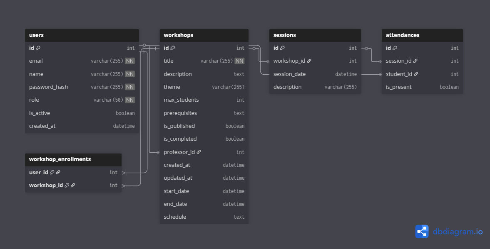

# Projeto ELLP - Controle de Oficinas  

<p align="center">
  
</p>


## 🤖 Sobre o Grupo ELLP  

O **ELLP (Ensino Lúdico de Lógica e Programação)** é um projeto de extensão universitária iniciado em **2014 na UTFPR – Câmpus Cornélio Procópio**.  

Ele atua como uma **porta de entrada para a extensão**, permitindo que os alunos universitários transmitam seus conhecimentos teóricos de forma prática para a comunidade.  

Seus principais objetivos são:  
- **Ampliar o acesso à educação** para comunidades em situação de vulnerabilidade social.  
- **Oferecer infraestrutura e conhecimento** gerados dentro da universidade.  
- Aproximar **crianças e adolescentes de escolas públicas, ONGs e creches** do ambiente acadêmico, muitas vezes visto como inacessível.  


## 🎯 Sobre este Projeto (Controle de Oficinas)  

O **Controle de Oficinas** é uma plataforma web desenvolvida para auxiliar na **gestão das atividades do Grupo ELLP**, oferecendo:  

- Gestão de oficinas (criação, edição, publicação e controle de vagas).  
- Cadastro e autenticação de usuários (professores, tutores e alunos).  
- Catálogo de oficinas e inscrições de alunos.  
- Registro de presença e conclusão.  
- Emissão de certificados em PDF.  
- Histórico acadêmico dos participantes.  

Esse sistema busca **organizar e otimizar a logística das oficinas**, facilitando a interação entre alunos, tutores e professores, além de garantir maior acessibilidade à comunidade atendida.  


## 🎓 Contexto Acadêmico  

Este projeto está sendo desenvolvido no âmbito da disciplina **Oficina de Integração 2** (ES47C - ES71) do curso de Engenharia de Software da **UTFPR – Câmpus Cornélio Procópio**.  

- **Professor responsável:** Prof. Antonio Carlos Fernandes da Silva  


## 📑 Planejamento

O planejamento detalhado do desenvolvimento do projeto está disponível na pasta de documentação.  
Acesse clicando no link abaixo:  

➡️ [Planejamento - Controle de Oficinas](https://github.com/gustavoprezoto/ellp-controle-oficinas/blob/main/Documenta%C3%A7%C3%A3o/Planejamento%20-%20Controle%20de%20Oficinas.pdf)

### Resumo do Planejamento

**Plataforma de Controle de Oficinas de Ensino**  
O documento descreve o plano de desenvolvimento para a plataforma web destinada a gerenciar o ciclo de vida das oficinas do projeto ELLP, envolvendo Professores, Tutores, Alunos e a emissão de certificados.


### 1️⃣ Requisitos Funcionais
| Requisito | Título | Prioridade |
|-----------|-------|-----------|
| RF-001 | Usuário pode ser administrador (cadastra usuários e altera templates de certificado) | Média |
| RF-002 | Login e logout seguros | Alta |
| RF-003 | Painel para gerenciar oficinas ministradas | Alta |
| RF-004 | Criar e editar oficinas (tema, descrição, datas, horários, limite de vagas e pré-requisitos) | Alta |
| RF-005 | Publicar ou despublicar oficinas | Alta |
| RF-006 | Visualizar lista de alunos inscritos | Alta |
| RF-007 | Registrar presença dos alunos | Alta |
| RF-008 | Marcar oficina como "Concluída" liberando certificados | Alta |
| RF-009 | Aluno verifica participação e comprovante | Baixa |
| RF-010 | Comprovante enviado por e-mail após conclusão | Alta |

---

### 2️⃣ Arquitetura em Alto Nível

**Componentes:**
1. **Frontend (Server-side Rendering)**  
   - Aplicação SSR onde o backend gera páginas front-end.
2. **Backend (Servidor)**  
   - Módulo de Autenticação e Usuários  
   - Módulo de Oficinas  
   - Módulo de Alunos/Certificados (geração de PDF)  
   - Módulo de Server-Side Rendering
3. **Banco de Dados**  
   - PostgreSQL para armazenar usuários, oficinas, inscrições e presenças.


### 3️⃣ Estratégia de Automação de Testes

**Pirâmide de Testes:**
- **Unidade:** Jest + React Testing Library (frontend), Pytest (backend)  
- **Integração:** React Testing Library + Pytest-Django  
- **Ponta a ponta:** Cypress ou Playwright  


### 4️⃣ Tecnologias Utilizadas

- **Frontend:** React.js (Hooks, Context API), Material-UI, Axios  
- **Backend:** Python + FastAPI  
- **Banco de Dados:** PostgreSQL

### 5️⃣ Cronograma

**Planejamento (até 15/09):**  
- Documento de planejamento e setup inicial dos repositórios  

**Sprint 1 (22/09 - 03/11):**  
1. Setup inicial e modelagem do banco  
2. Gestão de usuários (cadastro de professores, alunos e CRUD)  
3. Gestão de oficinas (CRUD e publicação)  
4. Catálogo e inscrição de alunos  

**Sprint 2 (04/11 - 08/12):**  
1. Registro de presença e finalização de oficinas  
2. Geração de certificados em PDF  
3. Tela de histórico do aluno  
4. Ajustes finais: testes, correções de bugs e melhorias de UX

### 6️⃣ Modelo do banco de dados


### 7️⃣ Como rodar o projeto
### Backend (FastAPI)

1. **Pré-requisitos:**
   - PostgreSQL instalado

2. **Configuração do Banco:**
   ```bash
   # Configurar variável de ambiente
   export DATABASE_URL="postgresql://<usuario>:<senha>@localhost/<nome_do_banco>"
   
   # Executar script SQL de inicialização
   psql -U <usuario> -d <nome_do_banco> -f database_scripts/init.sql
   ```

3. **Executar Backend:**
   ```bash
   cd backend
   python -m venv venv
   source venv/bin/activate  # ou venv\Scripts\activate no Windows
   pip install -r requirements.txt
   uvicorn app.main:app --reload --host 0.0.0.0 --port 8145
   ```

### Frontend (React.js)

```bash
cd frontend
npm install
npm run dev
```

Acesse: http://localhost:3000

## 👤 Usuários de Teste

| Email | Senha | Perfil |
|-------|-------|---------|
| admin@ellp.com | 123456 | Administrador |
| professor@ellp.com | 123456 | Professor |
| aluno@ellp.com | 123456 | Aluno |

## 👨‍💻 Integrantes  

- João Pedro de Araujo (RA: 2525852)  
- Gustavo Prezoto Boca (RA: 2250373)  
- Gabriel Henrique de Almeida Souza (RA: 2504162)  

✍️ **Desenvolvido por alunos de Engenharia de Software – UTFPR Cornélio Procópio**  
